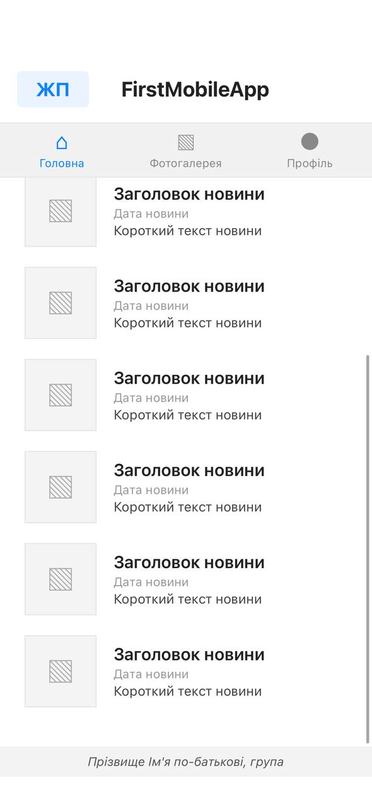
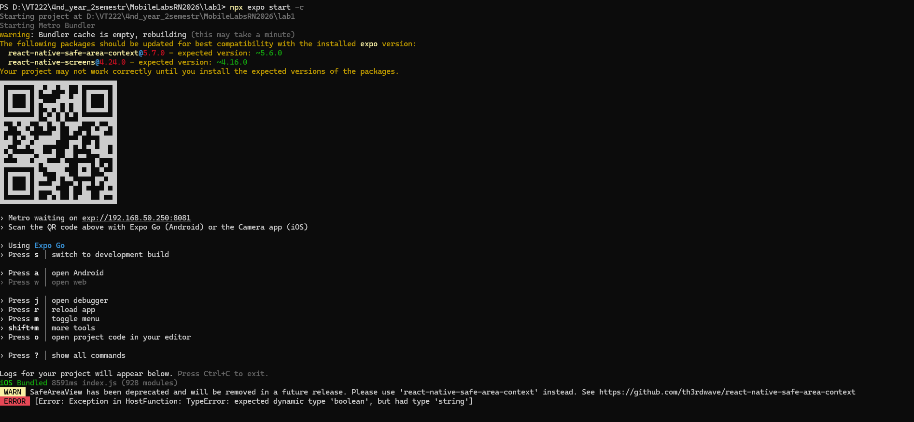

# MobileLabsRN2026

Лабораторна робота з дисципліни мобільної розробки.

## Опис проєкту

Проєкт створено на React Native / Expo.\
Додаток містить базову навігацію між екранами та форму реєстрації
користувача.

## Використані технології

- React Native
- Expo
- JavaScript
- React Navigation

## Структура проєкту

- `App.js` --- головний файл додатку
- `components/` --- компоненти інтерфейсу
- `screens/` --- екрани додатку
- `assets/` --- зображення та інші ресурси

## Встановлення залежностей

```bash
npm install
```

## Запуск проєкту

```bash
npx expo start
```

## Основний функціонал

- Відображення головного екрану
- Форма реєстрації
- Поля для email, пароля, імені та прізвища
- Кнопка реєстрації
- Адаптивний інтерфейс

## Скріншоти роботи

### Головний екран



### Екран реєстрації


### Запуск проєкту в терміналі



## Висновок

У ході виконання лабораторної роботи було створено мобільний додаток на
React Native / Expo. Було реалізовано базову структуру проєкту,
інтерфейс користувача та форму реєстрації. Отримано практичні навички
запуску, тестування та оформлення мобільного застосунку.
