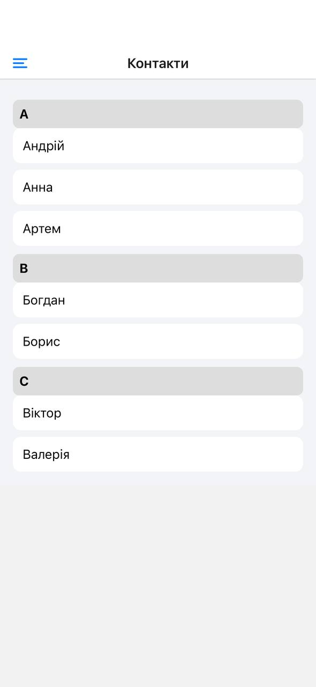

# Лабораторна робота №2

## Тема

Побудова вкладеної навігації та оптимізація відображення списків у React Native.

## Мета роботи

Ознайомлення з принципами навігації у мобільних застосунках, реалізація вкладеної навігації та ефективного відображення великих списків за допомогою FlatList і SectionList.

---

## Запуск проєкту

```bash
npm install
npx expo start
```

---

## Структура проєкту

```
lab2/
├── App.js
├── components/
│   └── CustomDrawer.js
├── screens/
│   ├── MainScreen.js
│   ├── DetailsScreen.js
│   └── ContactsScreen.js
```

---

## Реалізований функціонал

### Навігація

- Drawer Navigator
- Stack Navigator
- Передача параметрів між екранами
- Динамічний заголовок

### FlatList

- Pull-to-Refresh
- Infinite Scroll
- Header / Footer / Separator

### Оптимізація

- initialNumToRender
- maxToRenderPerBatch
- windowSize

### SectionList

- Групування даних
- Заголовки секцій

### Drawer

- Аватар
- Ім’я
- Група

---

## Скріншоти

### Головний екран з FlatList


### Екран деталей новини


### Екран контактів з SectionList



## Відповіді на питання

1. FlatList рендерить тільки видимі елементи, ScrollView — всі.
2. Віртуалізація — відображення тільки видимих елементів.
3. navigation.navigate('Screen', { param })
4. Вкладена навігація — navigator в navigator.
5. SectionList — для групованих даних.

---

## Висновок

Було реалізовано навігацію, списки та оптимізацію продуктивності React Native застосунку.
