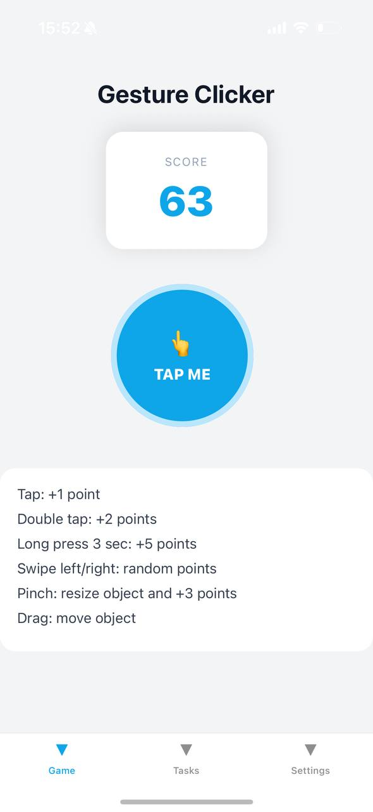
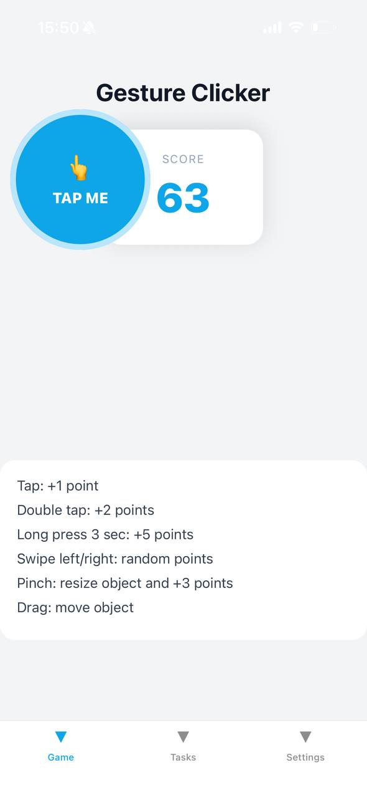
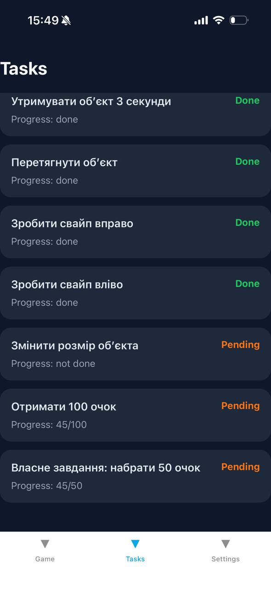
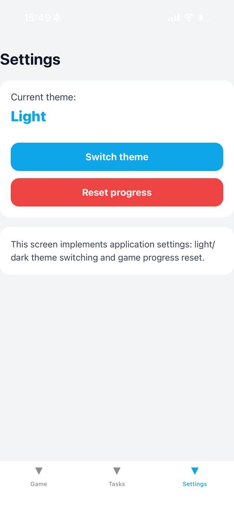
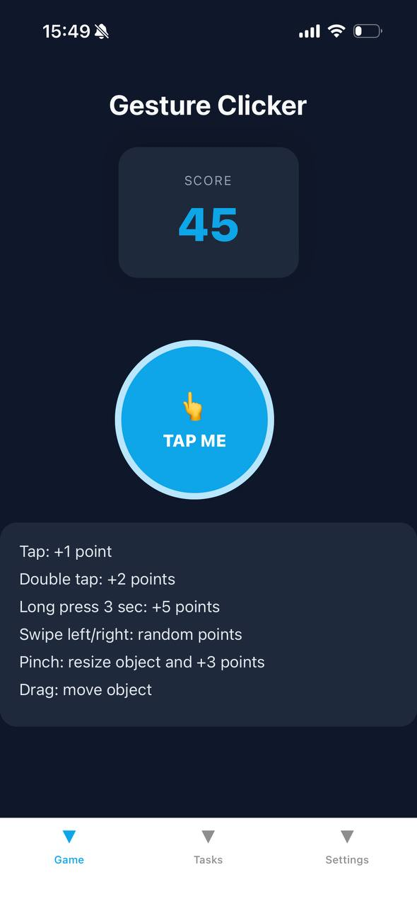

# Lab 3 -- Gesture Clicker (React Native)

## Опис

Мобільний застосунок у вигляді гри-клікера з використанням жестів
користувача.

## Функціонал

### Головний екран

- Лічильник очок
- Інтерактивний об'єкт (кнопка)

### Реалізовані жести

- Tap → +1 очко
- Double Tap → +2 очка
- Long Press (3 сек) → +5 очок
- Drag → переміщення об'єкта
- Swipe left/right → випадкові очки
- Pinch → зміна розміру + бонус

### Сторінка завдань

- Відображення прогресу
- Автоматичне оновлення статусу (Done/Pending)

### Сторінка налаштувань

- Перемикання теми (Light/Dark)
- Скидання прогресу

## Навігація

Використано Expo Router (tabs navigation)

## Стилізація

- StyleSheet
- Підтримка світлої та темної теми

## Запуск

npm install npm start

## Скріншоти

### Головний екран гри

На головному екрані відображається назва застосунку, лічильник очок та інтерактивна кнопка для виконання жестів.

### Перетягування об’єкта

Об’єкт можна переміщувати по екрану за допомогою жесту Drag.

### Сторінка завдань

На сторінці завдань показано список цілей, їхній прогрес та статус виконання.

### Налаштування застосунку

На сторінці налаштувань реалізовано перемикання світлої/темної теми та скидання прогресу.

### Темна тема

Застосунок підтримує темний режим інтерфейсу.

## Висновок

У роботі було реалізовано мобільний застосунок з підтримкою жестів
користувача. Було використано сучасні інструменти React Native для
створення інтерактивного інтерфейсу, а також реалізовано систему завдань
та тем оформлення.
