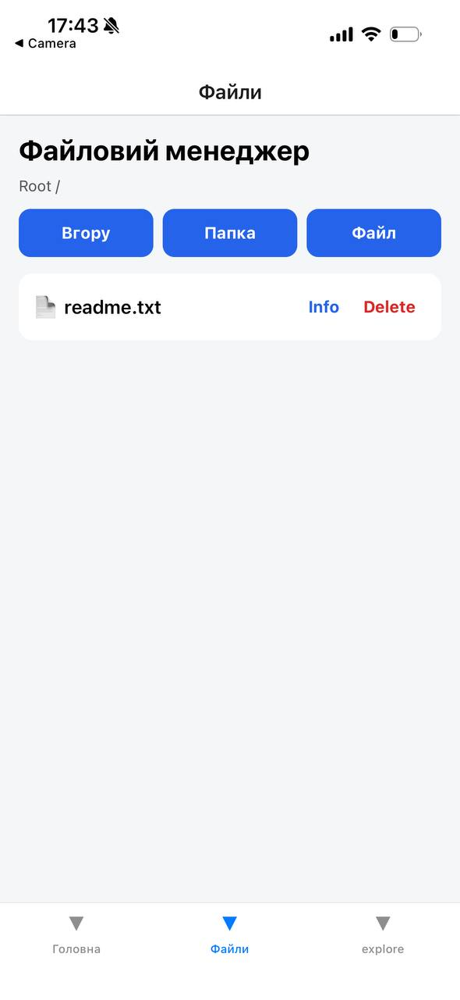
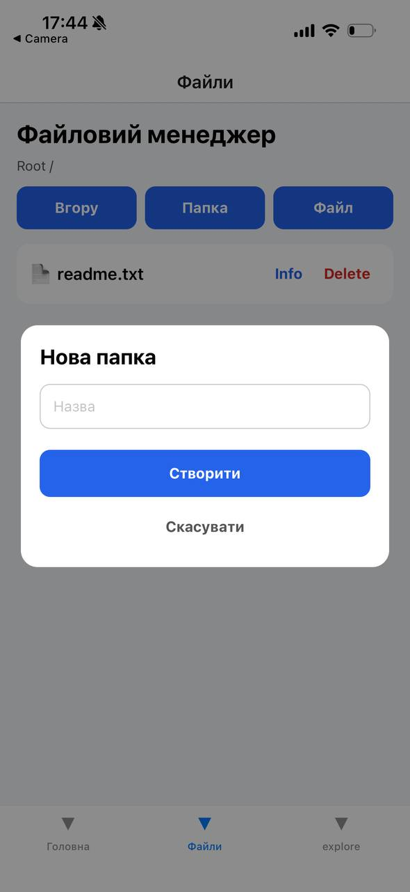
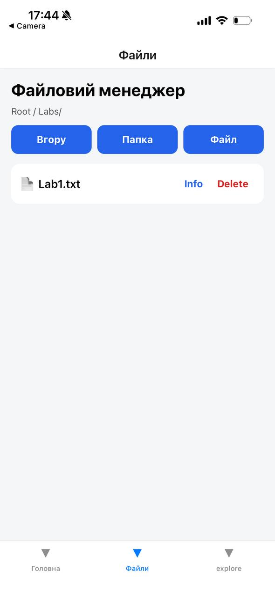
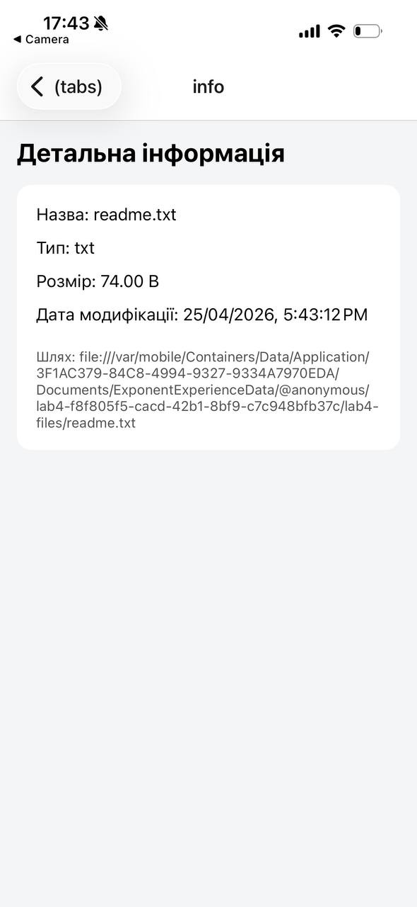
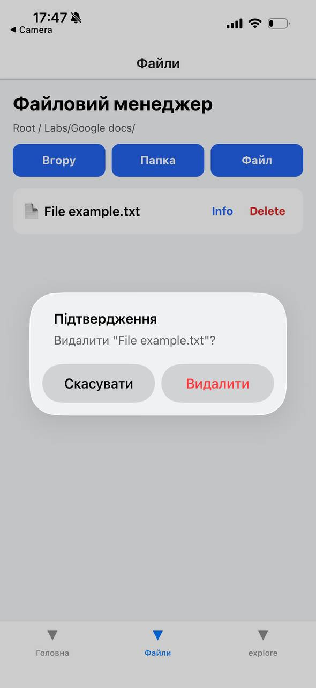

# Лабораторна робота №4

## Тема

Робота з файловою системою в React Native з використанням бібліотеки `expo-file-system`.

## Мета роботи

Опанувати механізми роботи з локальною файловою системою мобільного пристрою за допомогою бібліотеки `expo-file-system`, а також реалізувати базові операції над файлами та папками у мобільному застосунку.

## Назва застосунку

**Файловий менеджер**

## Використані технології

- React Native
- Expo
- Expo Router
- TypeScript
- expo-file-system
- React Navigation

## Функціональні можливості застосунку

У застосунку реалізовано:

- перегляд статистики памʼяті пристрою;
- відображення загального, вільного та зайнятого простору;
- навігацію по локальній файловій системі застосунку;
- відображення поточного шляху;
- перегляд списку файлів і папок;
- перехід у вкладені папки;
- повернення до попередньої директорії;
- створення нової папки;
- створення нового текстового файлу `.txt`;
- перегляд вмісту текстових файлів;
- редагування текстових файлів;
- збереження змін у файлі;
- видалення файлів і папок;
- підтвердження перед видаленням;
- перегляд детальної інформації про файл або папку:
  - назва;
  - тип;
  - розмір;
  - дата останньої модифікації;
  - повний шлях.

## Структура проєкту

```text
lab4/
├── app/
│   ├── _layout.tsx
│   ├── modal.tsx
│   ├── editor.tsx
│   ├── info.tsx
│   └── (tabs)/
│       ├── _layout.tsx
│       ├── index.tsx
│       └── manager.tsx
├── src/
│   ├── services/
│   │   └── fileService.ts
│   └── utils/
│       └── format.ts
├── assets/
├── package.json
└── README.md
```

## Опис основних файлів

### `app/(tabs)/index.tsx`

Головний екран застосунку. На ньому відображається статистика памʼяті пристрою:

- загальний обсяг памʼяті;
- вільний простір;
- зайнятий простір.

Також з цього екрану можна перейти до файлового менеджера.

### `app/(tabs)/manager.tsx`

Основний екран файлового менеджера. Реалізує:

- перегляд вмісту директорії;
- перехід у папки;
- повернення вгору;
- створення файлів і папок;
- видалення обʼєктів;
- перехід до перегляду інформації;
- відкриття `.txt` файлів для редагування.

### `app/editor.tsx`

Екран редагування текстового файлу. Користувач може переглянути вміст `.txt` файлу, змінити його та зберегти результат.

### `app/info.tsx`

Екран детальної інформації про файл або папку. Виводить назву, тип, розмір, дату модифікації та шлях.

### `src/services/fileService.ts`

Сервісний файл для роботи з файловою системою. Містить функції для:

- ініціалізації директорії застосунку;
- читання директорії;
- створення папок;
- створення текстових файлів;
- читання текстових файлів;
- збереження змін;
- видалення файлів і папок;
- отримання інформації про обʼєкт;
- отримання статистики памʼяті.

### `src/utils/format.ts`

Допоміжні функції для форматування:

- розміру файлів;
- дати модифікації;
- типу файлу за розширенням.

## Встановлення та запуск

### 1. Перейти в папку проєкту

```bash
cd lab4
```

### 2. Встановити залежності

```bash
npm install
```

### 3. Встановити бібліотеку для роботи з файловою системою

```bash
npx expo install expo-file-system
```

### 4. Запустити застосунок

```bash
npx expo start
```

або з очищенням кешу:

```bash
npx expo start -c
```

### 5. Відкрити застосунок

Застосунок можна відкрити:

- через Expo Go на мобільному пристрої;
- через Android Emulator;
- через iOS Simulator.

## Інструкція користування

1. Запустити застосунок.
2. На головному екрані переглянути статистику памʼяті пристрою.
3. Перейти у вкладку **Файли**.
4. Натиснути **Папка**, щоб створити нову папку.
5. Натиснути **Файл**, щоб створити новий `.txt` файл.
6. Натиснути на папку, щоб перейти всередину.
7. Натиснути **Вгору**, щоб повернутися до попередньої директорії.
8. Натиснути на `.txt` файл, щоб відкрити його для перегляду та редагування.
9. Натиснути **Info**, щоб переглянути детальну інформацію.
10. Натиснути **Delete**, щоб видалити файл або папку. Перед видаленням зʼявляється підтвердження.

## Скріншоти роботи застосунку

> Скріншоти потрібно додати вручну після запуску застосунку.

### 1. Файловий менеджер зі списком файлів і папок



### 2. Створення нової папки



### 3. Створення текстового файлу



### 4. Детальна інформація про файл або папку



### 5. Підтвердження видалення



## Очікуваний результат

У результаті виконання лабораторної роботи було створено мобільний застосунок **«Файловий менеджер»**, який дозволяє працювати з локальною файловою системою застосунку. Програма підтримує створення, перегляд, редагування та видалення текстових файлів і папок, а також перегляд детальної інформації про обʼєкти файлової системи.

## Висновок

Під час виконання лабораторної роботи було розроблено застосунок на React Native з використанням Expo та бібліотеки `expo-file-system`. Було реалізовано базову файлову навігацію, створення папок і текстових файлів, редагування вмісту файлів, видалення обʼєктів з підтвердженням та перегляд інформації про файли й папки. Також було додано екран статистики памʼяті пристрою. Отримані навички можуть бути використані для створення мобільних застосунків, які працюють з локальними файлами користувача.
